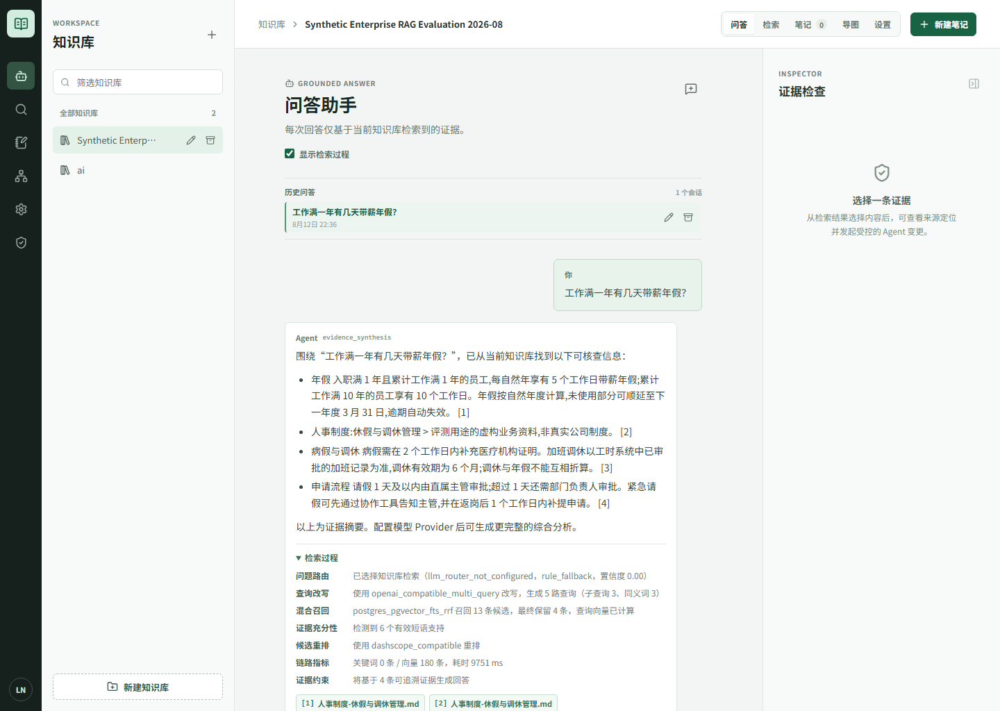
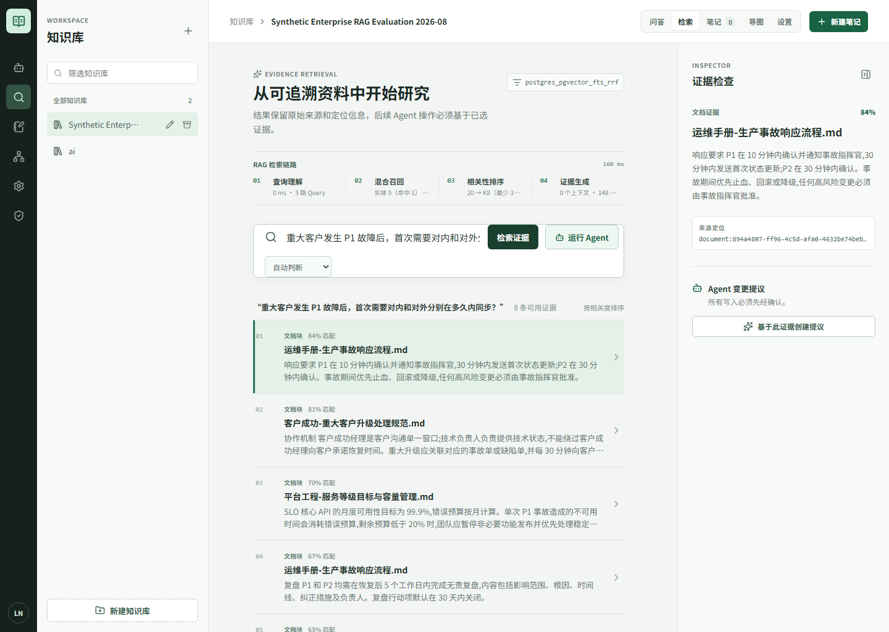
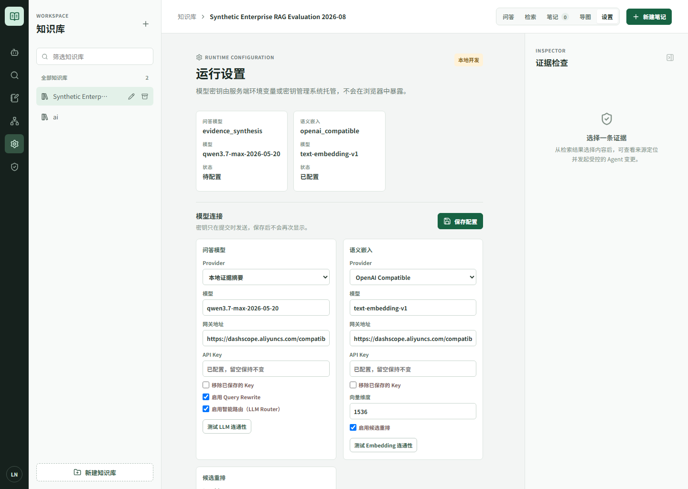
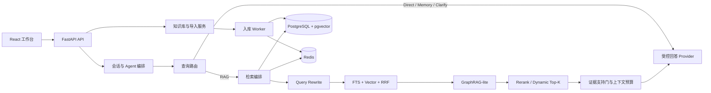

# RAG Notes Agent

> 面向个人与小团队的可追溯 Agentic RAG 知识工作台。

[](https://www.python.org/)
[](https://fastapi.tiangolo.com/)
[](https://react.dev/)
[](https://www.docker.com/)
[](LICENSE)

RAG Notes Agent 用于把分散的文档、笔记和网页资料沉淀为可检索知识库，并在问答时提供可定位的证据引用。它不把“模型能回答”当作“资料已证明”：查询先路由、再按需检索，回答只允许基于当前工作区的证据生成；证据不足时明确拒答，而不是拼接无关内容或产生伪引用。

项目聚焦可工程化落地的 RAG：多格式导入、混合检索、GraphRAG-lite、受控多步检索、模型配置治理、质量评测与可观测性，而非仅提供一个聊天界面。

## 为什么需要它

企业或个人知识库常见三个问题：文档格式杂乱，关键词检索找不到同义表达；跨文档关系与全局归纳无法只靠相似文本完成；模型在无关资料上也可能给出貌似合理的回答。

本项目将这些问题拆解为可验证的链路：

```text
问题
  -> 路由（direct / memory / clarify / rag）
  -> Query Rewrite Plan（保留原问题 + 主查询 + 子查询 + 同义词）
  -> FTS + pgvector + 实体/标签定向召回
  -> RRF 融合 -> 可选 Cross-encoder Rerank -> Dynamic Top-K
  -> Parent-Child 上下文扩展 / GraphRAG-lite 关系与社区扩展
  -> 证据支持门 -> 受证据约束的流式回答与引用快照
```

## 核心能力

| 场景 | 已实现能力 | 设计约束 |
| --- | --- | --- |
| 文档入库 | TXT、Markdown/Typora、PDF、DOCX、网页 URL；结构化切分、代码围栏保护、内容指纹去重 | 网页导入具备 HTTPS、DNS/IP、重定向与响应大小限制，降低 SSRF 风险 |
| 知识管理 | 知识库创建、改名、归档，已导入文档归档删除，手工笔记版本化 | 文档、笔记、向量和图谱索引按工作区隔离 |
| 问答路由 | `direct`、`memory`、`clarify`、`rag` 四类路由；规则优先，LLM 仅处理灰区 | 显式资料请求强制进入 RAG；低置信度与模型故障安全回退 RAG |
| 混合召回 | PostgreSQL FTS/GIN + pgvector HNSW + 加权 RRF；实体和受控标签定向召回 | 定向路径只补充候选，通用 Hybrid 始终保留兜底 |
| 检索增强 | 多路 Query Rewrite、Rerank 缓存与规则回退、Metadata Boost、Parent-Child、Dynamic Top-K | 原问题始终保留；策略可关闭，收益必须进入固定评测集比较 |
| GraphRAG-lite | 实体/关系索引、一跳关系扩展、两层社区摘要、可选加权 Louvain 社区发现与全局问题覆盖采样 | 图谱候选仍回指原始切块；算法实际运行值与回退状态可审计 |
| 可信回答 | SSE 流式输出、Markdown 渲染、引用快照、证据预算、无答案拒答 | 局部问题候选完全缺少有效短语支持时清空证据，避免伪引用 |
| Agent 治理 | LangGraph 只读检索、有限步 Agentic RAG、写操作提议审批、审计事件与回放 | 最大步数、Token 与延迟由服务端强制；写操作必须人工审批 |
| 生产治理 | Redis 优先缓存/内存回退、模型并发闸门、超时、指数退避、Token 上限、分级限流 | 密钥只在服务端加密保存，浏览器不展示数据库连接或 API Key |
| 质量与观测 | 版本化评测、A/B 策略快照、拒答率、Prometheus、OpenTelemetry | 日志、指标和 Trace 不写入问题、Prompt、证据正文、URL 或密钥 |

## 产品截图

以下截图来自 Docker 验收环境的隔离**合成企业资料**。模型密钥只展示配置状态，不包含真实 Key 或用户知识库内容。

### 证据约束问答

问答页展示流式回答、引用编号和可展开的公开检索过程。过程只说明路由、改写、候选数量、排序和耗时，不输出模型隐式推理或完整 Prompt。



### 混合检索研究台

研究页将关键词/向量召回、RRF 融合、重排、上下文扩展等阶段汇总为可检查的诊断信息；用户可查看候选来源与定位，并基于已选证据发起受控 Agent 提议。



### 模型与检索策略设置

设置页只暴露 LLM、Embedding、可选 Reranker、Query Rewrite 与 LLM Router 等可配置能力；数据库、Redis 连接和已保存密钥不会暴露给浏览器。



## 功能详解

### 1. 知识工程：从资料导入到可检索资产

- **多格式解析**：支持 TXT、Markdown、Typora Markdown、PDF、DOCX 和网页 URL。Markdown 保留标题层级、表格和代码围栏，避免技术文档在切块时丢失代码语义。
- **安全网页导入**：限制 HTTPS、重定向次数、响应体大小与超时；在抓取前验证 DNS/IP，拒绝内网地址与危险协议，降低 SSRF 风险。
- **资料治理与来源复核**：可为资料维护可信度、生效/到期、冲突和替代关系；已替代或未来生效资料不会参与召回，过期/冲突资料降权保留溯源。网页来源可由默认关闭的独立 Worker 按低频批次复核；可选正文变化检测只标记“内容已变化”，必须由用户确认后手动重新导入，绝不静默覆盖已存档证据。
- **去重与可恢复导入**：通过内容指纹避免重复文档反复入库；归档删除会同步清理索引，用户可以重新导入相同内容。
- **异步入库状态机**：导入任务具备租约、指数退避、最大重试和 dead-letter 状态。Worker 中断后可回收租约，不会把同一任务并发执行。
- **结构化切分与 Parent-Child**：子块用于精确召回，命中后补充同章节相邻上下文；回答引用始终回指实际命中的子块定位。
- **知识维护**：支持知识库新建、重命名、归档，已导入文档可删除；手工笔记为独立版本化知识层，也会进入后续混合检索。

### 2. 问答助手：先判断，再检索，再生成

- **四路意图路由**：将请求区分为 `direct`（身份、能力、操作说明）、`memory`（当前会话与明确保存的个人资料）、`clarify`（指代不完整）和 `rag`（知识库事实）。避免“你是谁”“谢谢”此类问题无意义检索并产生伪引用。
- **规则优先、LLM 灰区补充**：高置信规则保证确定性；未命中规则的灰区问题可由 LLM 输出受限 JSON 路由。显式“根据文档”“资料中”等请求强制进入 RAG；LLM 不可用或置信度不足时安全回退。
- **受证据约束生成**：LLM Provider 只接收当前工作区的证据副本，系统提示要求每条事实结论标注 `[n]` 引用；资料不足时必须明确说明，不能依赖模型先验补全事实。
- **无答案防伪引用**：对局部问题执行检索后证据支持门。若候选完全不包含问题中的有效实体/短语，将候选清空，使回答走“证据不足”路径并不生成引用；关系和全局图谱问题不受该局部门禁误伤。
- **会话与反馈**：回答以 SSE 流式返回并持久化会话；支持有帮助/无帮助反馈、固定原因选择、分诊与后续知识草稿/评测用例回流。

### 3. 检索增强：可组合、可回退、可测量

- **混合召回**：生产路径使用 PostgreSQL FTS/GIN 与 pgvector HNSW，按 Reciprocal Rank Fusion 融合；本地 SQLite 保留确定性回退，调用层统一使用 `Evidence` 契约。
- **结构化 Query Rewrite**：可选 LLM 改写生成主查询、子查询和同义词，原始问题始终保留为一路候选；多路结果按 locator 去重并加权 RRF 融合，模型失败自动使用原问题。
- **定向召回 + 通用兜底**：入库阶段建立实体到切块的倒排关系；经人工审批的业务标签也可作为补充候选。两条定向路径不作为硬过滤条件，任一路为空都不会影响通用 Hybrid 召回。
- **Rerank 与噪声控制**：候选先做低信息预过滤，再可接入 OpenAI-compatible/DashScope-compatible Cross-encoder；Reranker 响应、网络或配置异常时回退确定性规则排序。
- **Dynamic Top-K 与上下文预算**：根据分数断崖、来源覆盖、问题模式和 Token 预算选择最终证据数；上下文超过预算时只截断给模型的副本，原始引用快照保持完整。
- **Redis 优先缓存**：Query Embedding、Rewrite Plan 和 Rerank 结果可进入 Redis；Redis 未部署或不可用时自动降级到进程内 TTL LRU，不让缓存故障阻断问答。

### 4. GraphRAG-lite 与有限步 Agent

- **关系问题**：针对“A 如何影响 B”“原因链是什么”等问题，从实体命中切块进行一跳关系扩展，再与 Hybrid 候选 RRF 融合。
- **全局问题**：通过两层社区摘要识别主题，再按文档/实体覆盖采样原始切块，避免只返回语义最相似的一小段资料；最终引用仍定位到原始文档块。
- **社区算法可演进**：默认使用确定性连通分量；Docker 镜像已包含可选的 NetworkX 依赖，可通过 `APP_GRAPH_COMMUNITY_ALGORITHM=louvain` 按关系置信度加权划分稠密子社区，固定随机种子保证可复现。依赖缺失或算法异常会明确回退并写入图谱状态，防止把配置意图伪装成实际能力。
- **受限 Agentic RAG**：关系/全局问题可进入最多 N 步的只读再检索。每一步根据新增 locator、来源覆盖、估算 Token 和耗时判断是否继续，服务端强制最大步数、Token 和延迟预算。
- **写操作审批**：Agent 可提出创建笔记、更新笔记、归档文档等变更，但不会直接执行。提议包含风险等级、证据快照、过期时间和版本校验，只有具备权限的角色审批后才会写入。

### 5. 模型、配置与访问治理

- **用户可配置模型**：工作区可独立配置问答 LLM、Embedding、Reranker、Query Rewrite 和 LLM Router，并提供连接测试；配置更新后会触发嵌入版本门控，防止新旧向量空间混用。
- **密钥保护**：浏览器不会读取已保存 API Key、数据库 URL 或 Redis URL。服务端缺失 Fernet 密钥时拒绝持久化用户密钥，不会降级为明文存储。
- **工作区隔离**：开发环境提供默认工作区；生产 PostgreSQL 使用 Row Level Security，所有领域查询显式携带 workspace 边界，可配置 API Key 与审批角色映射。
- **运行保护**：问答、Embedding、Rewrite、Rerank 与图谱抽取共用并发闸门、调用超时、指数退避和输出 Token 上限；API 按读取、写入、生成和 Agent 请求执行分级限流。

### 6. 可观测性与质量闭环

- **阶段事件**：每次问答以 `route -> rewrite -> retrieve -> fuse -> rerank -> truncate -> answer -> judge` 固化脱敏事件，记录哈希、候选 locator、计数、耗时、缓存和错误类型，用于 badcase 归因与受控回放。
- **策略 A/B**：`baseline / rewrite / rerank / current` 通过内存 Settings 快照运行，不会改写用户的工作区配置；报告同时记录请求策略和实际 fallback/cached 状态。
- **离线门禁**：检索评测覆盖 Top1、Recall@K、MRR、关键词覆盖、噪声率和无答案拒答率；路由评测独立验证四类路由且不检索、不生成、不写入会话。
- **图谱与回答补充评测**：社区索引门禁验证实体/原始切块回指、图谱版本和算法回退；DeepEval 以显式外发授权的可选离线适配器提供相关性/忠实度观察信号，永不替代确定性引用和拒答门禁。
- **低敏观测**：Prometheus 和 OpenTelemetry 默认关闭；开启后只采集路由模板、耗时、计数、缓存状态与错误类型，禁止问题、正文、URL、工作区和密钥进入标签。

## 系统架构



## 快速开始

### 方式零：下载 ZIP 一键启动（Windows）

在 GitHub 的 **Releases** 下载 `RAG-Notes-Agent-v*.zip`，或使用仓库页面的 **Code -> Download ZIP**。
解压后双击根目录的 `Start-RAG-Notes-Agent.bat`：脚本会检查 Docker Desktop、在需要时启动它，执行
`docker compose up -d --build`，等待 API 健康检查通过后自动打开 `http://127.0.0.1:5173`。

首次启动需要拉取基础镜像和构建前后端，耗时取决于网络与设备。该方式不需要在宿主机安装 Python、Node.js、
PostgreSQL 或 Redis，但仍需要已安装 Docker Desktop。解压 ZIP 不会被系统静默执行程序，用户必须双击一次
启动脚本，这是 Windows 的安全限制。

停止时双击 `Stop-RAG-Notes-Agent.bat`，它只停止本项目容器并保留 PostgreSQL、Redis 卷；重新双击启动脚本
即可继续使用原有本地数据。维护者可运行以下命令生成与 GitHub Release 相同结构的干净源码包：

```powershell
.\scripts\package-release.ps1 -Version v0.1.2
```

### 方式一：Docker Compose（推荐）

仅需安装 Docker Desktop，无需在宿主机安装 PostgreSQL、Redis、Python 或 Node.js。

```powershell
git clone https://github.com/yanxiao07/RAG-Notes-Agent.git
cd RAG-Notes-Agent
docker compose up --build
```

服务启动后：

- 工作台：`http://localhost:5173`
- API 健康检查：`http://localhost:8000/health`
- OpenAPI：`http://localhost:8000/docs`

停止服务：

```powershell
docker compose down
```

### 并发导入扩容

生产 Compose 默认每个 Worker 进程并发处理 `2` 个任务。任务表使用短租约和 PostgreSQL
`FOR UPDATE SKIP LOCKED` 领取机制，可按积压量水平扩展多个 Worker：

```powershell
docker compose up -d --scale worker=4
```

该示例的理论任务并发为 `4 x 2 = 8`。实际值须受 CPU、PDF/DOCX 解析内存、数据库连接池和
Embedding 网关配额共同约束；`APP_MODEL_MAX_CONCURRENCY` 通过 Redis 在所有副本间共享，不能
仅按 Worker 数量放大。Redis 故障时系统降级为进程内并发闸门并记录告警，此时不应继续水平扩容。

`docker compose down -v` 会删除 PostgreSQL 与 Redis 的 Docker 数据卷，只应在确认不再需要本地数据时使用。

如需对已导入网页进行周期性来源复核，显式启用可选 Profile；该 Worker 与入库 Worker 分离，默认不启动。它只请求到期的网页来源，复用导入期 SSRF 校验，失败不会删除正文或索引。Profile 同时开启正文指纹比较，但发现变更只会写入状态提示，仍需用户手动重新导入：

```powershell
docker compose --profile source-revalidation up -d source-revalidator
```

### 方式二：本地开发

后端要求 Python 3.11+ 与 [uv](https://docs.astral.sh/uv/)，前端要求 Node.js 22+。

```powershell
# 终端 1：后端
cd backend
Copy-Item ..\.env.example .env
uv sync --extra dev --extra agent
uv run alembic upgrade head
uv run uvicorn app.main:app --reload --port 8000
```

```powershell
# 终端 2：前端
cd frontend
npm install
npm run dev -- --host 127.0.0.1 --port 5173
```

本地 SQLite + Hashing Embedding 仅适合功能开发和演示。需要验证 PostgreSQL 混合检索、pgvector HNSW、Redis 与 RLS 时，请使用 Docker Compose，并安装 `postgres` 额外依赖：

```powershell
cd backend
uv sync --extra dev --extra agent --extra postgres
```

## 模型配置

首次启动可使用内置的 `evidence_synthesis` Provider 体验证据摘要，不需要 API Key。要获得真实的流式综合回答，请在工作台的“设置”页填写 LLM、Embedding 与可选 Reranker 配置，或在部署环境设置环境变量：

```dotenv
APP_LLM_PROVIDER=openai_compatible
APP_LLM_BASE_URL=https://api.openai.com/v1
APP_LLM_MODEL=your-model-name
APP_LLM_API_KEY=your-secret

APP_EMBEDDING_PROVIDER=openai_compatible
APP_EMBEDDING_BASE_URL=https://api.openai.com/v1
APP_EMBEDDING_MODEL=your-embedding-model
APP_EMBEDDING_API_KEY=your-secret
```

模型配置采用 OpenAI-compatible 接口。用户提交的 API Key 仅在保存时发送一次，后端使用 Fernet 加密持久化，后续 API 只返回“是否已配置”。生产环境必须配置未提交的 `APP_CONFIGURATION_ENCRYPTION_KEY`，不要复用 Compose 中仅用于本地验收的默认值。

## RAG 质量与评测

任何 Query Rewrite、Rerank、Embedding、切分或检索策略变更，都不应只凭主观演示启用。本项目提供版本化用例、运行清单与质量门禁：

```powershell
cd backend

# 独立验证 direct / memory / clarify / rag 路由，不检索、不生成、不写会话
uv run python scripts/evaluate_query_routing.py `
  --cases evaluations/query-routing-cases.json `
  --router rule `
  --output artifacts/evaluations/routing-baseline.json

# 在隔离知识库上运行内存策略快照，不修改工作区模型配置
uv run python scripts/run_retrieval_experiment.py `
  --knowledge-base-id <知识库ID> `
  --cases evaluations/synthetic-enterprise-rag-cases.json `
  --strategy baseline `
  --output artifacts/evaluations/baseline.json
```

已在 Docker 隔离环境使用 39 条**合成**企业用例完成一次无答案门禁对照：37 条有答案用例的 Top1 为 `91.9%`、Recall@5 为 `100%`、MRR 为 `0.955`；新增 2 条无答案用例的拒答正确率从 `0%` 提升至 `100%`，离线运行增加约 `17ms`。

这些数据仅用于验证固定合成语料上的链路与回归门禁，不代表真实生产准确率、用户体验或通用 RAG 提升。完整方法、边界与报告见：[评测协议](docs/09-rag-evaluation-protocol.md) 与 [评测记录](docs/10-rag-evaluation-results.md)。

### 模拟生产验证边界

项目已在隔离 Docker 环境中对合成资料完成 PostgreSQL/pgvector、Redis、强制 RLS、社区切块回指和
Louvain 结构模拟验证。Louvain 模拟仅证明算法依赖、加权分区、固定种子与回退契约实际可运行，不宣称
检索质量提升；受控压测若出现冷缓存或 Query Rewrite 慢路径长尾，会被记录为风险，不能仅凭 P50/P95
写作性能通过。

```powershell
# 验证 Docker 镜像中的加权 Louvain 实现；不读取业务文档。
docker compose exec -T api sh -c "PYTHONPATH=/workspace/backend python scripts/verify_louvain_simulation.py --check"
```

关于合成检索评测、GraphRAG 结构门禁、RLS、可观测性模拟以及 SSO/第三方审计不能被模拟替代的原因，
见[模拟生产验证边界](docs/16-simulated-production-validation.md)。

## 安全与可靠性

- **租户隔离**：PostgreSQL 生产路径使用 workspace RLS；所有仓储查询显式携带工作区边界。
- **导入安全**：URL 导入限制协议、私有网络、重定向层数、响应大小与超时；导入内容在向量化前脱敏高置信凭证。
- **模型治理**：问答、Rewrite、Embedding、Rerank、图谱抽取共享并发闸门、超时、指数退避和 Token 上限。
- **可观测性**：可选 Prometheus 与 OpenTelemetry 默认关闭；只收集低基数路由、耗时、计数与错误类型。
- **可回退设计**：Redis、Query Rewrite、Rerank、图谱 LLM 抽取均有确定性回退路径，故障不应阻断基础检索。

## 开发与验证

```powershell
# 后端
cd backend
uv run pytest -q
uv run ruff check app tests scripts
uv run pyright app tests scripts

# 前端
cd frontend
npm run format
npm run build
```

仓库已提供 GitHub Actions，在 `main` 推送和 Pull Request 时执行后端测试、Ruff、Pyright、前端格式/构建及评测契约检查。

## 项目结构

```text
RAG-Notes-Agent/
├── backend/
│   ├── app/                 # FastAPI、领域模型、RAG、Agent、Worker
│   ├── migrations/          # Alembic 与 PostgreSQL/pgvector/RLS 迁移
│   ├── evaluations/         # 版本化评测语料与用例（只读基线）
│   ├── scripts/             # 回填、评测、压测、验收与导出脚本
│   └── tests/               # 单元、集成与评测契约测试
├── frontend/                # React 19 + Vite 工作台
├── docker/                  # PostgreSQL、观测、维护与压测配置
├── docs/                    # 需求、架构、API、数据与评测文档
├── artifacts/               # 被 Git 忽略的运行评测/压测工件
└── docker-compose.yml       # 本地 Docker 验收栈
```

## 文档导航

- [产品需求](docs/01-product-requirements.md)
- [系统架构](docs/02-architecture.md)
- [API 规范](docs/03-api-specification.md)
- [数据模型](docs/04-data-model.md)
- [工程规范](docs/05-engineering-standards.md)
- [交付路线图](docs/06-delivery-roadmap.md)
- [用户中心与工作区访问管理](docs/07-workspace-access-management.md)
- [对话式 Agentic RAG](docs/07-conversational-rag.md)
- [RAG 质量工程](docs/08-rag-quality-engineering.md)
- [RAG 评测协议](docs/09-rag-evaluation-protocol.md)
- [可选 LLM 判分评测](docs/14-llm-judge-evaluation.md)
- [GraphRAG 社区检索演进](docs/15-graph-community-retrieval.md)
- [模拟生产验证边界](docs/16-simulated-production-validation.md)
- [RAG 场景审查与 GraphRAG-lite](docs/12-rag-scenario-audit.md)
- [企业级 RAG 对照审查](docs/13-rag-enterprise-gap-analysis.md)

## 当前边界与路线

当前项目已具备 Docker 验收栈、PostgreSQL/pgvector、Redis、RLS、RAG/Agent 运行时与评测基础设施。以下能力仍需要真实业务数据、合规授权和人工标注后再进入生产结论：

- 真实业务评测集、容量基线和正式质量门禁；
- 真实 Cross-encoder、LLM Rewrite 与 GraphRAG 的 A/B 收益；
- 自动冲突发现、来源优先级学习、正文变更检测与真实业务有效期规则；
- 社区向量索引、Louvain/社区检索的真实业务 A/B 基准与更细粒度的图检索评测；
- 用户中心、完整备份策略和第三方安全审查。

项目坚持“先评测、后启用”的原则：未经本项目固定语料、固定模型和可复现实验验证的数字，不写作性能提升或生产能力。

## License

本项目采用 [MIT License](LICENSE)。
