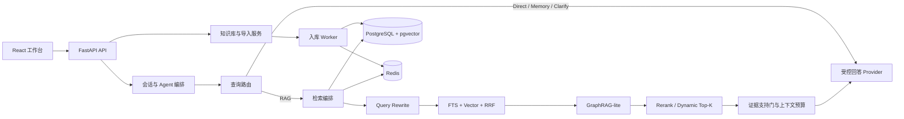

# RAG Notes Agent

> 面向个人与小团队的可追溯 Agentic RAG 知识工作台。

[](https://www.python.org/)
[](https://fastapi.tiangolo.com/)
[](https://react.dev/)
[](https://www.docker.com/)
[](LICENSE)

RAG Notes Agent 用于把分散的文档、笔记和网页资料沉淀为可检索知识库，并在问答时提供可定位的证据引用。它不把“模型能回答”当作“资料已证明”：查询先路由、再按需检索，回答只允许基于当前工作区的证据生成；证据不足时明确拒答，而不是拼接无关内容或产生伪引用。

项目聚焦可工程化落地的 RAG：多格式导入、混合检索、GraphRAG-lite、受控多步检索、模型配置治理、质量评测与可观测性，而非仅提供一个聊天界面。

## 为什么需要它

企业或个人知识库常见三个问题：文档格式杂乱，关键词检索找不到同义表达；跨文档关系与全局归纳无法只靠相似文本完成；模型在无关资料上也可能给出貌似合理的回答。

本项目将这些问题拆解为可验证的链路：

```text
问题
  -> 路由（direct / memory / clarify / rag）
  -> Query Rewrite Plan（保留原问题 + 主查询 + 子查询 + 同义词）
  -> FTS + pgvector + 实体/标签定向召回
  -> RRF 融合 -> 可选 Cross-encoder Rerank -> Dynamic Top-K
  -> Parent-Child 上下文扩展 / GraphRAG-lite 关系与社区扩展
  -> 证据支持门 -> 受证据约束的流式回答与引用快照
```

## 核心能力

| 场景 | 已实现能力 | 设计约束 |
| --- | --- | --- |
| 文档入库 | TXT、Markdown/Typora、PDF、DOCX、网页 URL；结构化切分、代码围栏保护、内容指纹去重 | 网页导入具备 HTTPS、DNS/IP、重定向与响应大小限制，降低 SSRF 风险 |
| 知识管理 | 知识库创建、改名、删除，已导入文档归档删除，手工笔记版本化 | 文档、笔记、向量和图谱索引按工作区隔离 |
| 问答路由 | `direct`、`memory`、`clarify`、`rag` 四类路由；规则优先，LLM 仅处理灰区 | 显式资料请求强制进入 RAG；低置信度与模型故障安全回退 RAG |
| 混合召回 | PostgreSQL FTS/GIN + pgvector HNSW + 加权 RRF；实体和受控标签定向召回 | 定向路径只补充候选，通用 Hybrid 始终保留兜底 |
| 检索增强 | 多路 Query Rewrite、Rerank 缓存与规则回退、Metadata Boost、Parent-Child、Dynamic Top-K | 原问题始终保留；策略可关闭，收益必须进入固定评测集比较 |
| GraphRAG-lite | 实体/关系索引、一跳关系扩展、两层社区摘要、全局问题覆盖采样 | 图谱候选仍回指原始切块；无可追溯证据时不生成关系结论 |
| 可信回答 | SSE 流式输出、Markdown 渲染、引用快照、证据预算、无答案拒答 | 局部问题候选完全缺少有效短语支持时清空证据，避免伪引用 |
| Agent 治理 | LangGraph 只读检索、有限步 Agentic RAG、写操作提议审批、审计事件与回放 | 最大步数、Token 与延迟由服务端强制；写操作必须人工审批 |
| 生产治理 | Redis 优先缓存/内存回退、模型并发闸门、超时、指数退避、Token 上限、分级限流 | 密钥只在服务端加密保存，浏览器不展示数据库连接或 API Key |
| 质量与观测 | 版本化评测、A/B 策略快照、拒答率、Prometheus、OpenTelemetry | 日志、指标和 Trace 不写入问题、Prompt、证据正文、URL 或密钥 |

## 系统架构



## 快速开始

### 方式一：Docker Compose（推荐）

仅需安装 Docker Desktop，无需在宿主机安装 PostgreSQL、Redis、Python 或 Node.js。

```powershell
git clone https://github.com/yanxiao07/RAG-Notes-Agent.git
cd RAG-Notes-Agent
docker compose up --build
```

服务启动后：

- 工作台：`http://localhost:5173`
- API 健康检查：`http://localhost:8000/health`
- OpenAPI：`http://localhost:8000/docs`

停止服务：

```powershell
docker compose down
```

`docker compose down -v` 会删除 PostgreSQL 与 Redis 的 Docker 数据卷，只应在确认不再需要本地数据时使用。

### 方式二：本地开发

后端要求 Python 3.11+ 与 [uv](https://docs.astral.sh/uv/)，前端要求 Node.js 22+。

```powershell
# 终端 1：后端
cd backend
Copy-Item ..\.env.example .env
uv sync --extra dev --extra agent
uv run alembic upgrade head
uv run uvicorn app.main:app --reload --port 8000
```

```powershell
# 终端 2：前端
cd frontend
npm install
npm run dev -- --host 127.0.0.1 --port 5173
```

本地 SQLite + Hashing Embedding 仅适合功能开发和演示。需要验证 PostgreSQL 混合检索、pgvector HNSW、Redis 与 RLS 时，请使用 Docker Compose，并安装 `postgres` 额外依赖：

```powershell
cd backend
uv sync --extra dev --extra agent --extra postgres
```

## 模型配置

首次启动可使用内置的 `evidence_synthesis` Provider 体验证据摘要，不需要 API Key。要获得真实的流式综合回答，请在工作台的“设置”页填写 LLM、Embedding 与可选 Reranker 配置，或在部署环境设置环境变量：

```dotenv
APP_LLM_PROVIDER=openai_compatible
APP_LLM_BASE_URL=https://api.openai.com/v1
APP_LLM_MODEL=your-model-name
APP_LLM_API_KEY=your-secret

APP_EMBEDDING_PROVIDER=openai_compatible
APP_EMBEDDING_BASE_URL=https://api.openai.com/v1
APP_EMBEDDING_MODEL=your-embedding-model
APP_EMBEDDING_API_KEY=your-secret
```

模型配置采用 OpenAI-compatible 接口。用户提交的 API Key 仅在保存时发送一次，后端使用 Fernet 加密持久化，后续 API 只返回“是否已配置”。生产环境必须配置未提交的 `APP_CONFIGURATION_ENCRYPTION_KEY`，不要复用 Compose 中仅用于本地验收的默认值。

## RAG 质量与评测

任何 Query Rewrite、Rerank、Embedding、切分或检索策略变更，都不应只凭主观演示启用。本项目提供版本化用例、运行清单与质量门禁：

```powershell
cd backend

# 独立验证 direct / memory / clarify / rag 路由，不检索、不生成、不写会话
uv run python scripts/evaluate_query_routing.py `
  --cases evaluations/query-routing-cases.json `
  --router rule `
  --output artifacts/evaluations/routing-baseline.json

# 在隔离知识库上运行内存策略快照，不修改工作区模型配置
uv run python scripts/run_retrieval_experiment.py `
  --knowledge-base-id <知识库ID> `
  --cases evaluations/synthetic-enterprise-rag-cases.json `
  --strategy baseline `
  --output artifacts/evaluations/baseline.json
```

已在 Docker 隔离环境使用 39 条**合成**企业用例完成一次无答案门禁对照：37 条有答案用例的 Top1 为 `91.9%`、Recall@5 为 `100%`、MRR 为 `0.955`；新增 2 条无答案用例的拒答正确率从 `0%` 提升至 `100%`，离线运行增加约 `17ms`。

这些数据仅用于验证固定合成语料上的链路与回归门禁，不代表真实生产准确率、用户体验或通用 RAG 提升。完整方法、边界与报告见：[评测协议](docs/09-rag-evaluation-protocol.md) 与 [评测记录](docs/10-rag-evaluation-results.md)。

## 安全与可靠性

- **租户隔离**：PostgreSQL 生产路径使用 workspace RLS；所有仓储查询显式携带工作区边界。
- **导入安全**：URL 导入限制协议、私有网络、重定向层数、响应大小与超时；导入内容在向量化前脱敏高置信凭证。
- **模型治理**：问答、Rewrite、Embedding、Rerank、图谱抽取共享并发闸门、超时、指数退避和 Token 上限。
- **可观测性**：可选 Prometheus 与 OpenTelemetry 默认关闭；只收集低基数路由、耗时、计数与错误类型。
- **可回退设计**：Redis、Query Rewrite、Rerank、图谱 LLM 抽取均有确定性回退路径，故障不应阻断基础检索。

## 开发与验证

```powershell
# 后端
cd backend
uv run pytest -q
uv run ruff check app tests scripts
uv run pyright app tests scripts

# 前端
cd frontend
npm run format
npm run build
```

仓库已提供 GitHub Actions，在 `main` 推送和 Pull Request 时执行后端测试、Ruff、Pyright、前端格式/构建及评测契约检查。

## 项目结构

```text
RAG-Notes-Agent/
├── backend/
│   ├── app/                 # FastAPI、领域模型、RAG、Agent、Worker
│   ├── migrations/          # Alembic 与 PostgreSQL/pgvector/RLS 迁移
│   ├── evaluations/         # 版本化评测语料与用例（只读基线）
│   ├── scripts/             # 回填、评测、压测、验收与导出脚本
│   └── tests/               # 单元、集成与评测契约测试
├── frontend/                # React 19 + Vite 工作台
├── docker/                  # PostgreSQL、观测、维护与压测配置
├── docs/                    # 需求、架构、API、数据与评测文档
├── artifacts/               # 被 Git 忽略的运行评测/压测工件
└── docker-compose.yml       # 本地 Docker 验收栈
```

## 文档导航

- [产品需求](docs/01-product-requirements.md)
- [系统架构](docs/02-architecture.md)
- [API 规范](docs/03-api-specification.md)
- [数据模型](docs/04-data-model.md)
- [工程规范](docs/05-engineering-standards.md)
- [交付路线图](docs/06-delivery-roadmap.md)
- [对话式 Agentic RAG](docs/07-conversational-rag.md)
- [RAG 质量工程](docs/08-rag-quality-engineering.md)
- [RAG 评测协议](docs/09-rag-evaluation-protocol.md)
- [RAG 场景审查与 GraphRAG-lite](docs/12-rag-scenario-audit.md)
- [企业级 RAG 对照审查](docs/13-rag-enterprise-gap-analysis.md)

## 当前边界与路线

当前项目已具备 Docker 验收栈、PostgreSQL/pgvector、Redis、RLS、RAG/Agent 运行时与评测基础设施。以下能力仍需要真实业务数据、合规授权和人工标注后再进入生产结论：

- 真实业务评测集、容量基线和正式质量门禁；
- 真实 Cross-encoder、LLM Rewrite 与 GraphRAG 的 A/B 收益；
- 知识冲突、来源优先级、有效期与 supersedes 规则；
- Leiden/Louvain 社区算法、社区向量索引与更细粒度的图检索评测；
- 用户中心、完整备份策略和第三方安全审查。

项目坚持“先评测、后启用”的原则：未经本项目固定语料、固定模型和可复现实验验证的数字，不写作性能提升或生产能力。

## License

本项目采用 [MIT License](LICENSE)。
